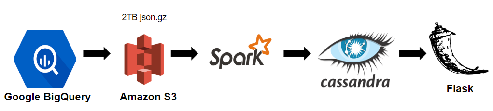

# Git-Social
A project to allow GitHub users make the most of their network. It enables them  with a dashboard to see the topics that the users they follow are working on and inversely find those specific users based on the topics listed.

### Project Idea:
To facilitate social network users to make the most out of their network.
Motivation and Business Case:
1. The number of users with more than 5 followers on GitHub: 658,769
2. GitHub users follow 10's and 100's of other users and their repositories as they are interested in their work.
One way of keeping up with their work is to go their profile and check their repositories to keep updated on what they are working on that interests the person that follows. This takes a huge effort from the user perspective. It saves a lot of effort if there is a list of topics that the users you follow are working on and seach the users directly based on those topics. This is what I achieved during my project which provides a web interface that takes a GitHub username and provides the list of topics the user's network is working on and on selection of any topics that you are interested in, provides the links to user profiles in your network that are working on the topic.
### Data Sources:
1.	GitHubArchive(https://bigquery.cloud.google.com/table/githubarchive:year): This dataset on Google BigQuery gives you event-based information on GitHub. This is to record the public GitHub timeline, archive it, and make it easily accessible for further analysis. The data is segregated based on year, month and day. The dataset is updated daily. The data per year is ~ 1TB. The total data from 2011-2018 in compressed form is ~2TB.
2.	GitHub Developer API(https://developer.github.com/v3/): The GitHub Developer API gives the information: 
a)	users and who they follow
b)	repos and the corresponding topics
The API has a limit of 5000 request per access token per hour. This creates a data collection issue as there are more than 40M records that must be collected. So, the relations of users to who they follow, and the repos and the corresponding topics have been simulated.
### Pipeline:

### AWS Clusters:
There are 3 main clusters as part of the pipeline:
•	6 m4.large for Spark() cluster
•	4 m4.large for Cassandra() cluster

## Layers of the Pipeline:
## 1.	Data Ingestion Layer:
The data from GitHubArchive is available on Google BigQuery and it has been exported to a Google Cloud Storage Bucket from which it has been moved to Amazon S3.
## 2.	Data Processing and Modeling Layer:
Apache Spark is a distributed processing engine which can crunch a huge amount of data and through Spark SQL, data can be modeled in the way you require. The data that I'm working on needs to be cleaned, pre-processed, processed(joins, aggregations) and modeled in the form that I require.
### Cleaning:
The data has a 3% of null values which includes the fields that are Primary Keys in my database. I have dropped the records which had null values in the columns that would become the Primary Keys in my database.
### Pre-Processing:
GitHub Archive data is event-based and I'm only interested in events: Fork-Event and Commit-Comment-Event. The data is filtered based on it and is further mapped on the columns(user, time, repo) that I'm interested on. The relations between and user-user and repo-topic has been simulated.
### Processing:
#### Joins: 
The invertion of relation is possible by joining the data from different sources. I have joined the tables users, time and repo wit another table with repo and topics with repo as my join key. This resulted in partitioning of data based on joining key repo. However, in my further operations that involved the aggregations of the join result are based on user or topic which makes it hard as the data is already partitioned on repo. Hence, I repartitioned the data based on user/topic and have performed the aggregations. The join that the Spark Catalyst chose is Sort-Merge join. However, I can experiment with other joins to check for any performance imporvement. 
#### Caching: 
The interim dataframes that are operated on are cached to improve the performance by 10 times.
#### Aggregations:
The aggregation can be a costly operation in a distributed envionment as it involves a shuffle operation. Using GroupByKey, every key-value pair gets shuffled across the network. I have chosen to use CombineByKey which combines the values at a partition level and then shuffles them. This reduced the amount of network traffic and imroved the performance.
#### Modeling:
The data is formed as a key-value pairs after aggregation to be fed to my database.
## 3.	Serving Layer:
Cassandra: The data from Spark is kept in three tables(User to Users, User to Topics, Topics to Users). It is a key-value form of a time-series data which has time as a clustering key.
## 4.	UI Layer:
The dashboard is created using Flask to search for the username for which you can look at the visualization of network and a list of topics and corresponding users that are working on those topics.

# Links to my works:
#### Google Slides: (http://bit.ly/gitSocial-slides)
#### Demo: (http://bit.ly/gitSocial-video)
#### LinkedIn: (https://linkedin.com/in/vinay92)
